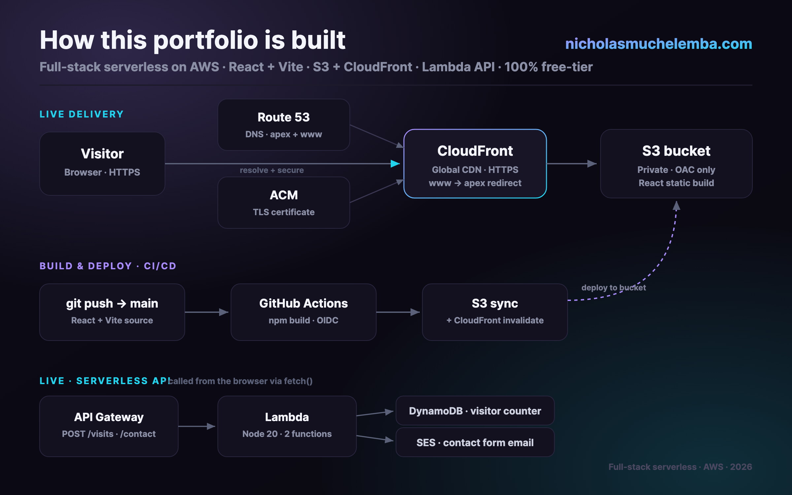

# Portfolio — [nicholasmuchelemba.com](https://nicholasmuchelemba.com)

A full-stack **serverless** personal portfolio on AWS, running entirely within the free tier.

- **Frontend:** React + Vite static build, served globally over HTTPS from a private
  S3 bucket via CloudFront (custom domain on Route 53, ACM cert, `www`→apex redirect).
- **Backend:** an HTTP API Gateway fronting two Lambda functions — a visitor counter
  (DynamoDB) and a contact form (SES).
- **CI/CD:** every push to `main` builds and deploys automatically via GitHub Actions
  (OIDC — no AWS keys stored).

## Architecture



```
Visitor ─▶ CloudFront (CDN · HTTPS · www→apex) ─▶ S3 (private, OAC) ─ React build
   │            ▲ Route 53 (DNS)  ▲ ACM (TLS)
   └─ fetch ─▶ API Gateway ─▶ Lambda ─▶ DynamoDB (visitor counter)
                                   └──▶ SES (contact form email)
```

## Quick start

```bash
npm install
npm run dev        # local dev server (http://localhost:5173)
npm run build      # production build -> dist/
npm run preview    # preview the production build locally
```

## Editing content

Almost everything lives in **`src/data/content.js`** — name, role, tagline, socials,
about, experience, projects, skills, education, and certifications. Edit that one file first.

Other touch points:
- Resume: `public/Nicholas_Muchelemba_Resume.pdf` (linked via `profile.resumeUrl`).
- Favicon / colors: `public/favicon.svg` and the `:root` design tokens in `src/index.css`.
- Architecture diagram: `public/architecture.svg` (and `.png` for sharing).

## Project structure

```
src/
  data/content.js      ← all editable copy lives here
  lib/api.js           ← fetch wrappers for the Lambda endpoints
  components/          ← Nav, Hero, About, Experience, Projects, Skills,
                          Credentials, Contact, Footer, Reveal
  index.css            ← single stylesheet (design tokens at the top)
backend/
  visits/index.mjs     ← Lambda: atomic visitor counter (DynamoDB)
  contact/index.mjs    ← Lambda: contact form email (SES)
public/                ← static assets copied as-is (resume, favicon, diagram)
.github/workflows/     ← deploy.yml (CI/CD)
```

## Backend API

`src/lib/api.js` calls the API at build-time URL `VITE_API_BASE_URL`
(set in `.env.production`). The UI degrades gracefully if it's unset — the counter
hides itself and the contact form falls back to `mailto:`.

| Method | Path        | Lambda does                          | Response         |
| ------ | ----------- | ------------------------------------ | ---------------- |
| POST   | `/visits`   | atomic increment + read in DynamoDB  | `{ "count": n }` |
| POST   | `/contact`  | send `{name,email,message}` via SES  | `{ "ok": true }` |

> SES runs in sandbox mode, so the contact form emails the owner's verified address
> (which is the intended destination). Request production access to accept arbitrary senders.

## Deployment

**Automatic (preferred):** push to `main` → GitHub Actions ([.github/workflows/deploy.yml](.github/workflows/deploy.yml))
builds, syncs `dist/` to S3, and invalidates the CloudFront cache. Auth is via GitHub
OIDC assuming a least-privilege IAM role; the bucket, distribution ID, region, and role
ARN are stored as repo **secrets** (no AWS keys committed, no resource IDs in the repo).

**Manual fallback** (requires AWS CLI access to the account):

```bash
npm run build
aws s3 sync ./dist s3://<bucket> --delete
aws cloudfront create-invalidation --distribution-id <dist-id> --paths '/*'
```

Infrastructure (S3, CloudFront, Route 53, ACM, API Gateway, Lambda, DynamoDB, SES,
IAM/OIDC) was provisioned via the AWS CLI; the raw config snapshots live in a local,
git-ignored `.aws/` directory.
